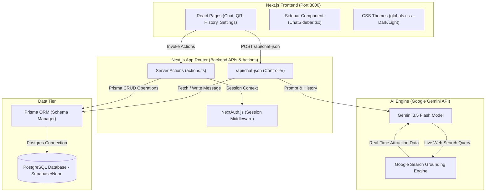
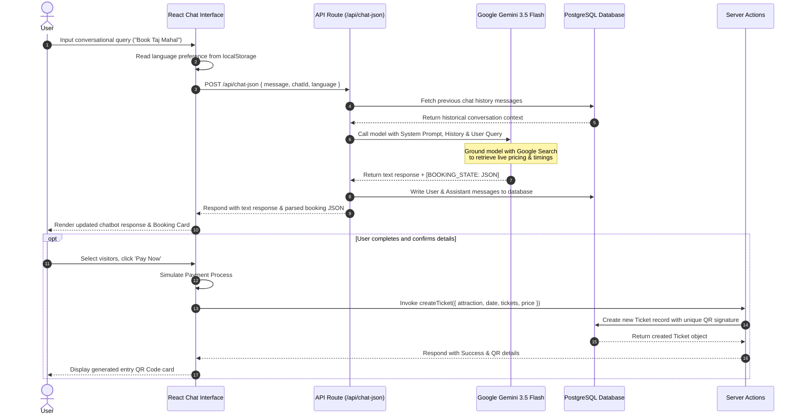

# KATAAR

**Get E-Tickets Faster with AI**

KATAAR is a next-generation e-ticketing platform built with Next.js, Prisma, and the Vercel AI SDK. By integrating Google Gemini's live web grounding capabilities, KATAAR allows users to conversationally search for, discover, and book tickets for any museum, art gallery, monument, or historic location worldwide—bypassing traditional complicated booking forms.

---

## Key Features

- **Conversational Booking Interface:** Chat with an AI agent to search for monuments, verify timings, and book tickets instantly.
- **Live Google Grounding:** The AI engine accesses live Google Search to provide up-to-date operating hours and ticketing information for any global attraction.
- **Dynamic Maps Integration:** Visual verification of the attraction location directly within the booking panel via Google Maps.
- **Soft Luxury UI:** A premium, glassmorphism-inspired aesthetic with dynamic micro-animations built using Tailwind CSS v4.
- **Secure Authentication:** Robust user session management using NextAuth.js.
- **Instant QR Code Issuance:** Post-payment, tickets are instantly generated with unique QR codes for seamless entry.

---

## System Architecture & Data Flow

### System Component Diagram
The diagram below details the components of KATAAR and how they interact:



### Attraction Booking Sequence
The request-response lifecycle for attraction discovery, booking details collection, and ticket creation:



---

## Repository Directory Structure

```text
KATAAR/
├── docs/                           # High-level project documentation
│   ├── design/                     # Design-related assets
│   │   ├── mockups/                # High-fidelity Figma / UI screens
│   │   └── README.md               # Summary of mockups and design guidelines
│   ├── ai/                         # Workspace assistant history (Git-ignored)
│   │   ├── .agents/                # AI instruction modules
│   │   ├── CLAUDE.md               # Claude CLI run configurations
│   │   └── ASSISTANT_LOGS.md       # Interaction and deployment logs
│   └── README.md                   # Project documentation structure overview
├── prisma/                         # Database schema & migrations
│   ├── schema.prisma               # Prisma schemas (User, Chat, Message, Ticket)
│   └── seed.ts                     # Database seeding utilities (optional)
├── public/                         # Static application assets
│   └── favicon.ico
├── src/                            # Application source code
│   ├── app/                        # Next.js App Router folders
│   │   ├── api/                    # API route endpoints
│   │   │   ├── auth/               # next-auth authentication endpoints
│   │   │   ├── chat/               # Conversational chat handlers
│   │   │   └── chat-json/          # Structural booking JSON parser endpoint
│   │   ├── chat/                   # Interactive chat interface page
│   │   ├── help/                   # Customer support and FAQ page
│   │   ├── history/                # Historical ticket transactions log page
│   │   ├── login/                  # User login interface
│   │   ├── profile/                # User account profile configurations page
│   │   ├── qr/                     # Generated QR Ticket display board
│   │   ├── register/               # New user signup portal
│   │   ├── settings/               # Dark/Light theme & Language selection controls
│   │   ├── globals.css             # Main theme variables (Dark/Light configurations)
│   │   ├── layout.tsx              # Root HTML wrapper and layout container
│   │   └── page.tsx                # Marketing landing interface page
│   ├── components/                 # Reusable UI widgets
│   │   ├── ChatSidebar.tsx         # Sidebar menu with chat title rename controls
│   │   ├── MessageBubble.tsx       # Text messages renderer bubble
│   │   ├── Providers.tsx           # Session providers wrapper (next-auth)
│   │   └── WeatherWidget.tsx       # Real-time weather dashboard indicator
│   ├── lib/                        # Core utilities & database connections
│   │   ├── actions.ts              # Next.js Server Actions (CRUD operations)
│   │   ├── prisma.ts               # PrismaClient database connection module
│   │   └── supabaseClient.ts       # Supabase integration module
│   ├── auth.ts                     # next-auth beta authentication configurations
│   └── middleware.ts               # Next.js routing protection middleware
├── .env.example                    # Sample environment configurations template
├── .gitignore                      # Git ignored files & directories rules
├── next.config.ts                  # Next.js compiler settings
├── package.json                    # Node dependencies and execution scripts
├── prisma.config.ts                # Prisma global parameters
└── tsconfig.json                   # TypeScript compiling parameters
```

---

## Tech Stack

- **Framework:** Next.js 15 (App Router, Server Actions)
- **AI Integration:** Vercel AI SDK (`ai`, `@ai-sdk/google`)
- **Model:** Google Gemini 3.5 Flash (with Search Grounding)
- **Database:** PostgreSQL (hosted via Supabase/Neon)
- **ORM:** Prisma Client with `@prisma/adapter-pg`
- **Authentication:** NextAuth.js (v5 Beta)
- **Styling:** Tailwind CSS v4 + Lucide Icons

---

## Getting Started

### 1. Prerequisites
Ensure you have Node.js (v18 or higher) and `npm` installed. You will also need a PostgreSQL database and a Google AI Studio API key.

### 2. Installation

Clone the repository and install dependencies:

```bash
git clone https://github.com/htan35/KATAAR.git
cd KATAAR
npm install
```

### 3. Environment Variables
Copy the provided `.env.example` file to create a local `.env.local` file:

```bash
cp .env.example .env.local
```

Open `.env.local` and fill in your secure credentials:
- `DATABASE_URL` (Your primary Postgres connection string or transaction pooler)
- `DIRECT_URL` (Your session-mode connection string for migrations)
- `GEMINI_API_KEY` (Your Google Gemini API key)
- `AUTH_SECRET` (A 32-character random string generated via `openssl rand -base64 32`)

> **Note:** Never commit `.env.local` to version control.

### 4. Database Setup
Push the Prisma schema to your remote database to create the required tables:

```bash
npx prisma db push
```

### 5. Start Development Server
Run the local development server:

```bash
npm run dev
```

Open [http://localhost:3000](http://localhost:3000) with your browser to see the application in action.

---

## Security Note

This repository is structured for production deployment. Sensitive credentials must be handled strictly through environment variables. The `prisma.config.ts` configuration routes standard migrations appropriately. Ensure that all `.env*` files (except `.env.example`) are added to your `.gitignore`.

---

*Built for speed. Built for convenience. No more lines with KATAAR.*
